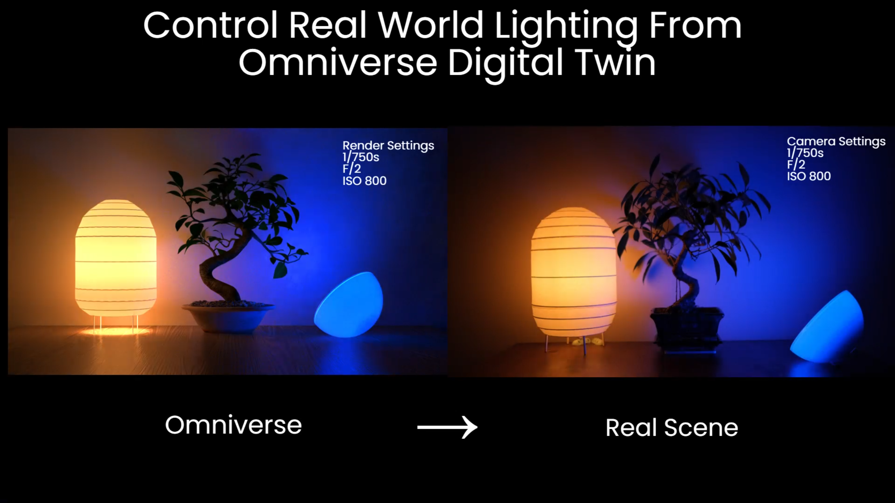
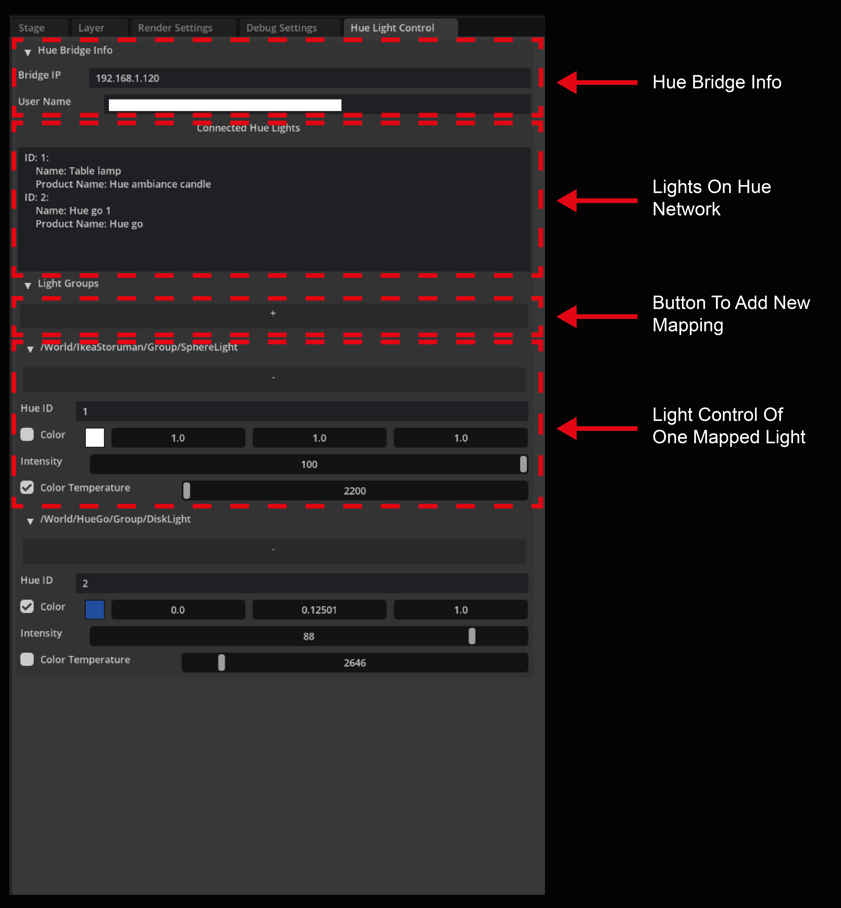
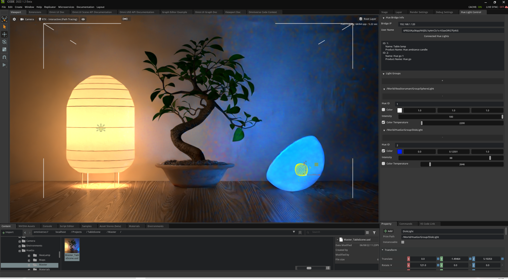

# omni-hue-control

Control Philips Hue light from Omniverse. Lighting design in Omniverse could be synchronised to real lights in real time.

Using the physical accurate Iray render, Omniverse could be powerful lighting design platform. Lighting design with Philiphs Hue light in Omniverse could be synchronised to real world light using [Hue API V2] (https://developers.meethue.com/develop/hue-api-v2/getting-started/)

## Using this Extension

1. Add Hue Bridge information. For getting the user name, please follow this [guide] (https://developers.meethue.com/develop/hue-api-v2/getting-started/)
With correct IP and user name, the extension will search the hue network and list all the luminaires. Please take a note of their corresponding Hue ID.
2. Select a light object in Omniverse and click the "+" button. It will create a new section in the UI for this light object to be mapped to a Hue luminaire.
3. Map Omniverse light to Hue light using the ID. With the Hue ID, some of the input fields might be disabled. For example: Color manipulation fields will be disabled for a color temperature changing only luminaire.
4. Changes of intensity, color temperature and color in the extension will change both light objects in Ominiverse and mapped real world Hue luminaires. 

## Adding This Extension

To add a this extension to your Omniverse app:
1. Add `git://github.com/XiaomingY/omni-hue-control.git?branch=main` to extension search path
2. Turn on HueControl

